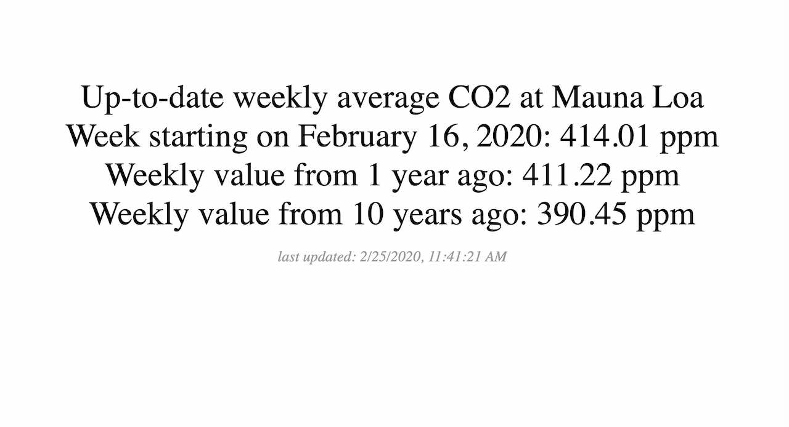
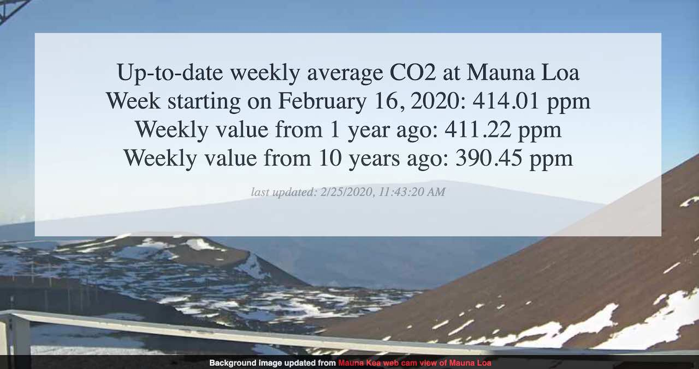

# Simple Update Screen for CO2 Data

by Alan Levine https://cog.dog or http://cogdogblog.com/

-----
*If this kind of stuff has any value to you, please consider supporting me so I can do more!*

[](https://patreon.com/cogdog) [](https://paypal.me/cogdog)
----- 

By request of Mike Kelly for a museum iPad kiosk to display data on C02 emissions measure at Manau Loa and reported by the [NOAA Earth Science Research Data trends site](http://www.esrl.noaa.gov/gmd/ccgg/trends/index.html). This creates a simple standalone display like:

[](https://cogdog.github.io/co2/)

The RSS Feed http://www.esrl.noaa.gov/gmd/webdata/ccgg/trends/rss.xml contains a mixture of monthly and weekly updates; it is the Weekly one desired because they give the data from the current week, a year ago, and 10 years ago. A sample entry:

```
<item>
  <title>Weekly CO2 Update for August 21, 2016</title>
  <link>
    http://www.esrl.noaa.gov/gmd/ccgg/trends/weekly.html
  </link>
  <guid isPermaLink="false">2016-8-21</guid>
  <description>
    Up-to-date weekly average CO2 at Mauna Loa <br> Week starting on August 21, 2016: 401.97 ppm <br> Weekly value from 1 year ago: 398.97 ppm <br> Weekly value from 10 years ago: 379.88 ppm
  </description>
  <pubDate>Mon, 29 Aug 2016 05:01:28 MDT</pubDate>
</item>
```


My original solution for this demonstration was to use Yahoo Query Language (YQL) on this feed to return from the  results just the description text where the item title starts with `Weekly CO2 Update` and to limit the results to 1 item, e.g. the most recent. The YQL query for this was

`https://query.yahooapis.com/v1/public/yql?q=select%20description%20from%20feed%20where%20url%3D'http%3A%2F%2Fwww.esrl.noaa.gov%2Fgmd%2Fwebdata%2Fccgg%2Ftrends%2Frss.xml'%20and%20title%20LIKE%20'Weekly%20CO2%20Update%25'%20LIMIT%201&format=json&diagnostics=true&callback=output_latest_co2_stats`

Sadly, as the web breaks, when Verizon bought Yahoo, they axed YQL.

This was re-written to use [rss2json](https://rss2json.com/) and works as it did before (see [blog post](https://cogdogblog.com/2020/02/old-simple-machine/)).


You can see it in action at https://cogdog.github.io/co2/ or this version that uses a background image from the Mauna Kea Webcam https://cogdog.github.io/co2/cam.html

[](https://cogdog.github.io/co2/cam.html)

## Update Notes

* Jan 17 2025: The NOAA web cams seem down, have switched the Webcam version to use cams from the USGS Hawaiian Volcano Observatory
* Dec 03 2023: Added the footer to webcam version
* Feb 24 2020: redesigned the data request due to change death of Yahoo Query language, switched to use of RSS feed converted o JSON, also added the web cam version. More in blog post [An Old, Simple Machine Fixed](https://cogdogblog.com/2020/02/old-simple-machine/)
* Aug 29 2016: First version published


